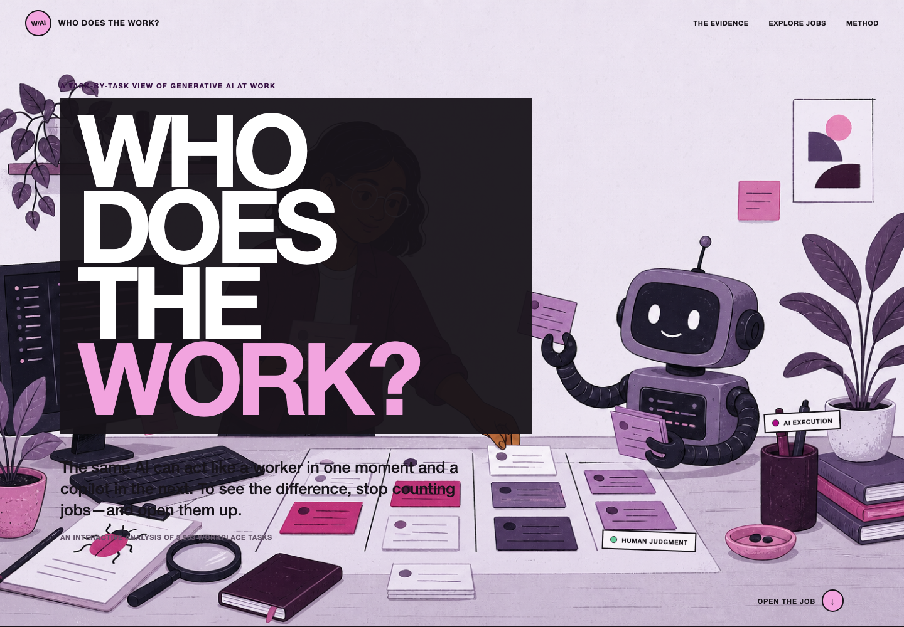
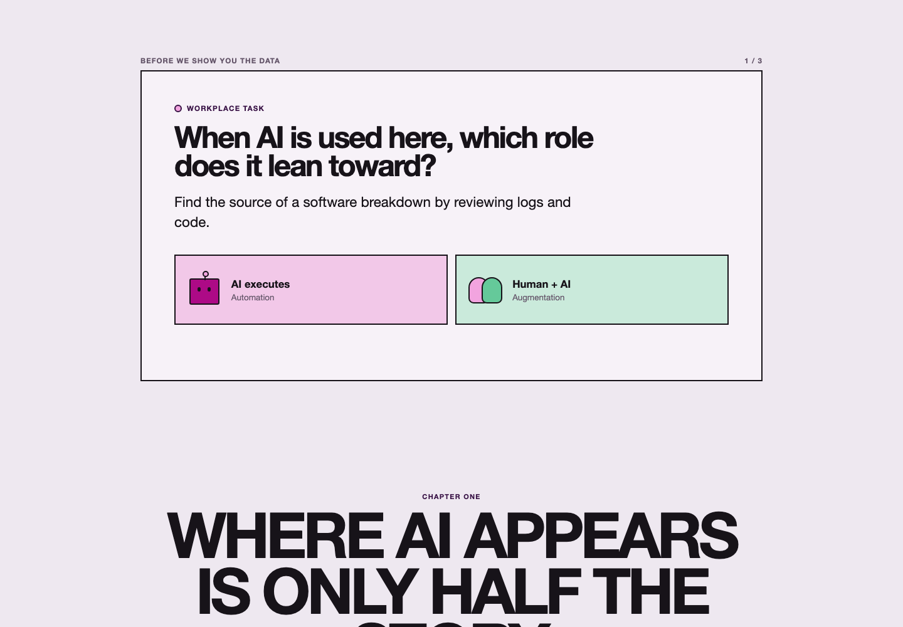
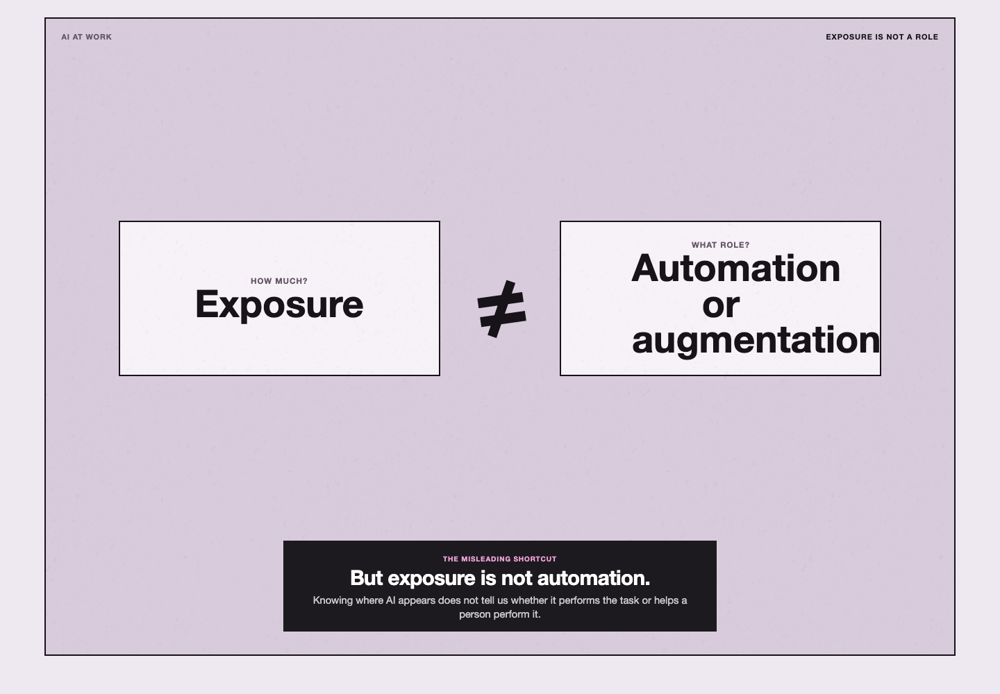
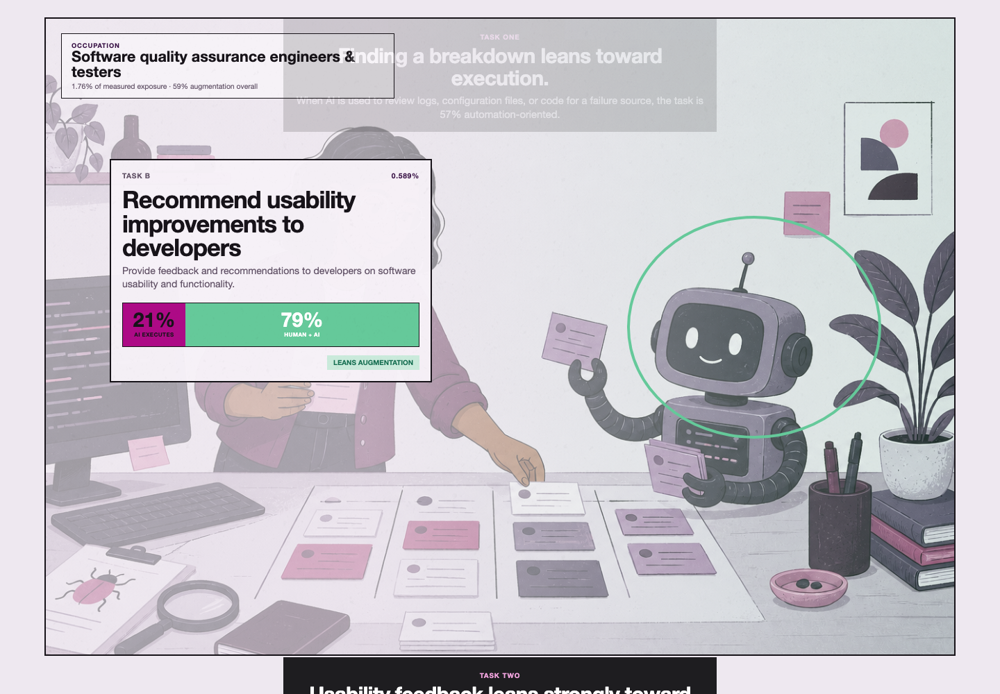
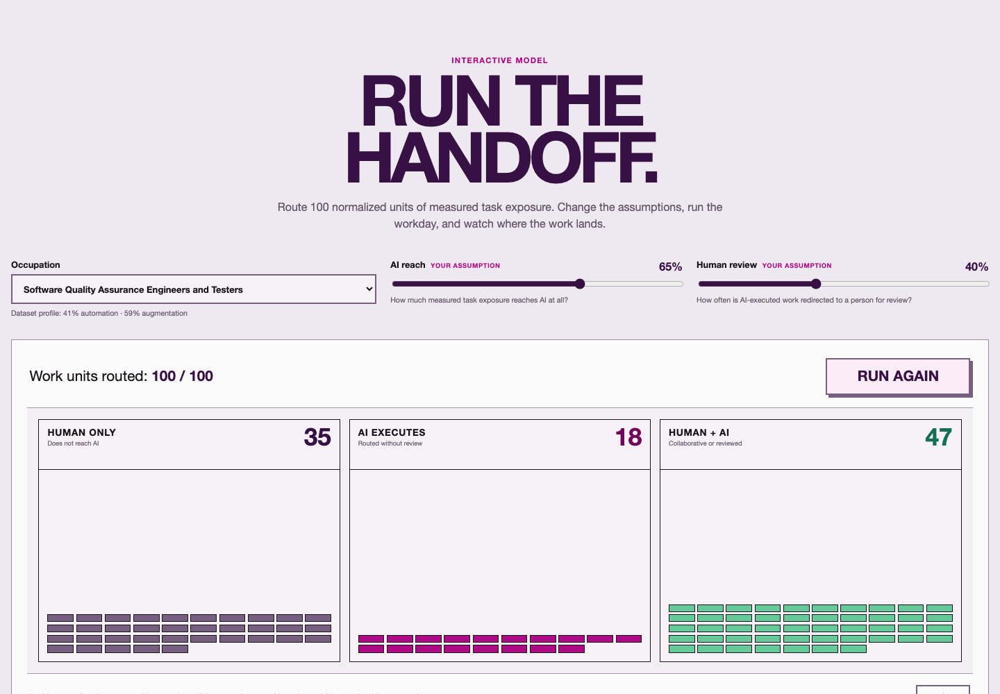
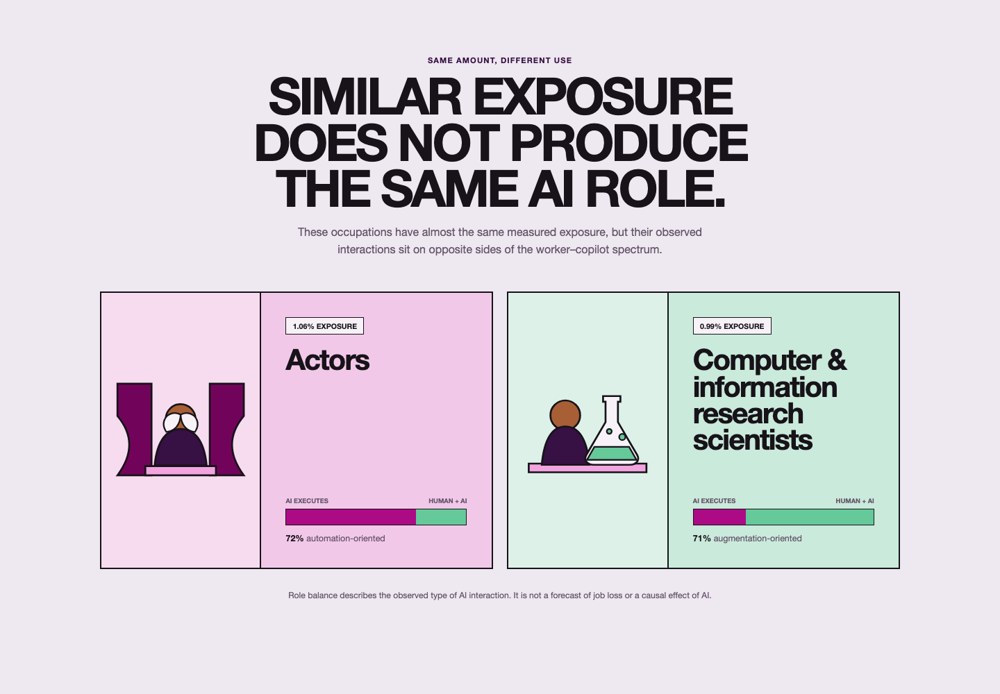
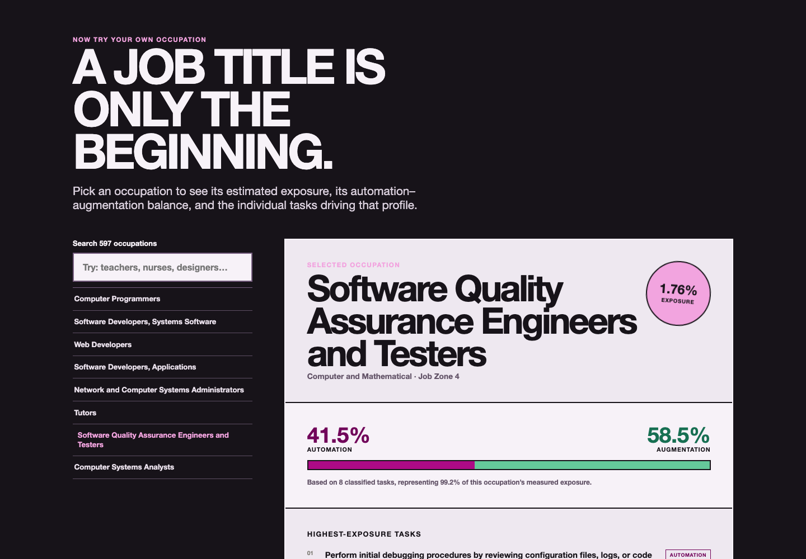

# Who Does the Work?

### A task-by-task view of generative AI, automation, and augmentation at work

[](https://svelte.dev/)
[](https://vite.dev/)
[](#data-and-method)
[](#occupation-explorer)

This repository contains an original interactive data story about a more useful question than
“Will AI automate this job?”:

> For each task inside a job, does AI perform the work—or help a person perform it?

The website opens jobs into their individual tasks and separates two roles for generative AI:

- **Automation:** AI executes the task through directive work or a feedback loop.
- **Augmentation:** a person works with AI through iteration, learning, or validation.


**Main finding:** among the measured exposure that could be classified, **43% is
automation-oriented and 57% is augmentation-oriented**. The larger lesson is not that every job
follows this average. Tasks inside the same occupation can place AI in very different roles.

## Project highlights

- Interactive story built with Svelte 5 and Vite 7
- Analysis of **3,963 occupation–task pairs** across **731 source occupations**
- Searchable browser profiles for **597 occupations** with usable role data
- Three-question task quiz with immediate, data-backed feedback
- Two scroll-driven evidence chapters with sticky visual states
- Configurable handoff simulation with 100 normalized work units
- Job-family, preparation-level, occupation, and task comparisons
- Responsive layouts, semantic labels, keyboard focus states, and reduced-motion support
- Reproducible data build, production build, screenshot capture, and GIF-generation scripts

## Research question

A job is a bundle of activities: writing, checking, deciding, documenting, listening, teaching,
and producing. A single job-level label hides how AI enters each part of that bundle.

The story therefore separates two questions:

```text
How much does AI appear?                  What role does AI play?
          |                                         |
      exposure                     automation or augmentation
          |                                         |
          +---------------- not the same -----------+
```

Exposure tells us **where AI appears**. Role balance tells us **how AI is used when it appears**.
Neither measure, by itself, predicts layoffs or proves a causal effect.

## Key findings

### Overall role balance

| Role | Share of classified exposure | Included interaction modes |
|---|---:|---|
| **Automation** | **43%** | Directive (30.5%) + feedback loop (12.6%) |
| **Augmentation** | **57%** | Iteration (24.8%) + learning (28.5%) + validation (3.6%) |

The usable role profile covers **2,573 of 3,963 rows** and represents **94.39% of total measured
exposure**.

### Exposure is concentrated

The five most-exposed occupations contribute **26.05%** of measured exposure in this dataset.

| Occupation | Share of measured exposure |
|---|---:|
| Computer programmers | 7.64% |
| Systems software developers | 7.13% |
| Web developers | 4.58% |
| Applications software developers | 3.64% |
| Network and systems administrators | 3.06% |

### One occupation can contain both roles

The software quality-assurance example compares two tasks with similar exposure:

| Task | Exposure | Automation | Augmentation | Lean |
|---|---:|---:|---:|---|
| Find the source of a software breakdown | 0.658% | 57.4% | 42.6% | Automation |
| Recommend usability improvements | 0.589% | 21.1% | 78.9% | Augmentation |

The occupation title is identical, but the role of AI changes with the task.

### Similar exposure can still mean different use

Actors and computer and information research scientists have almost equal measured exposure—1.06%
and 0.99%—but their role profiles point in opposite directions. Actors are 71.9%
automation-oriented in the sample; research scientists are 71.0% augmentation-oriented.

### Context matters

Human-facing and highly specialized job families are more augmentation-oriented in this descriptive
sample. Job Zone 5 work is **68.3% augmentation-oriented**, compared with roughly **53–55%** for
Zones 2–4. This is an association in the supplied data, not evidence that preparation level causes a
specific AI role.

## Website walkthrough

### 1. Start with a task, not a job title

The opening establishes the central distinction and invites the reader to “open the job.” A
three-question quiz then asks readers to classify real tasks before seeing the aggregate evidence.

| Opening | Task quiz |
|:---:|:---:|
|  |  |

### 2. Separate exposure from role

The first scrollytelling chapter moves through five states: all task pairs, concentration in the top
five occupations, the exposure-versus-role distinction, the 43–57 balance, and the five interaction
modes.



### 3. Open one workday

Maya, a fictional software quality-assurance engineer, connects the abstract measures to two real
tasks and values in the data. The worker is illustrative; the occupation, tasks, and measurements are
not fictional.



### 4. Run the handoff

The simulation routes 100 normalized units into three lanes:

- **Human only:** the unit does not reach AI.
- **AI executes:** AI performs the task and the output is not redirected for review.
- **Human + AI:** the task is collaborative or AI-executed work is reviewed by a person.

Readers can select an occupation and change two assumptions: **AI reach** and **human review**.



This component is an explanatory model. It does **not** estimate productivity, quality, time saved,
job loss, or whether an organization should adopt AI.

### 5. Compare occupations and work contexts

The comparison section shows why similar exposure does not imply a similar role. The next section
compares role balance by job family and job-preparation level.



### 6. Explore an occupation

The searchable explorer exposes the occupation profile, job family, Job Zone, total exposure,
automation–augmentation balance, coverage, and up to 12 of its highest-exposure classified tasks.



## Data and method

### Source and grain

The primary source is the supplied packaged Tableau workbook
[`figures/AI_OR_I(2).twbx`](<figures/AI_OR_I(2).twbx>). Its embedded analysis table contains one row
per **occupation–task pair**.

| Item | Value |
|---|---:|
| Source rows | 3,963 |
| Source occupations | 731 |
| Rows with usable role profiles | 2,573 |
| Classified share of measured exposure | 94.39% |
| Occupations in the web explorer | 597 |
| Job families represented in the explorer | 22 |
| Job Zones represented | 1–5 |

The browser-ready explorer file is
[`occupation-profiles.json`](Tableau_Website/public/data/occupation-profiles.json). To keep the file
small, it stores at most the 12 highest-exposure classified tasks for each eligible occupation.

### Role construction

The five observed interaction modes are grouped into two broad roles:

```text
Automation   = directive + feedback loop
Augmentation = iteration + learning + validation
```

Task shares are aggregated with exposure weights to create occupation, job-family, Job Zone, and
overall profiles. Display values are rounded; the generated JSON keeps six decimal places.

### Handoff simulation logic

For the selected occupation, the simulator:

1. Normalizes the exposure of its displayed classified tasks into 100 units.
2. Uses the **AI reach** control to select how many units encounter AI.
3. Uses each unit's task-level automation share to sample execution versus collaboration.
4. Uses the **human review** control to redirect some AI-executed units to Human + AI.
5. Changes a deterministic run seed when the reader chooses **Run again**.

This logic is implemented in
[`HandoffSimulation.svelte`](Tableau_Website/src/lib/HandoffSimulation.svelte).

## Requirements

- Node.js **20.19+** or **22.12+**
- npm (the lockfile is included)
- Python 3 for rebuilding the occupation explorer
- Optional: Google Chrome and Pillow for regenerating README media

The completed website can be run without Tableau. Tableau is only needed if you want to inspect or
edit the packaged workbook itself.

## Installation

Clone the repository and enter the website directory:

```bash
git clone https://github.com/Namprire/Tableau.git
cd Tableau/Tableau_Website
npm install
```

## Quick start

Start the Vite development server:

```bash
npm run dev
```

Open [http://localhost:5173](http://localhost:5173).

The development server provides hot reloading for Svelte components and CSS.

## Validation and production build

Run the Svelte diagnostics:

```bash
npm run check
```

Build the production site:

```bash
npm run build
```

Preview the generated `dist/` directory:

```bash
npm run preview
```

## Rebuild the explorer data

The data builder reads the embedded CSV from the packaged Tableau workbook and writes the compact
browser payload:

```bash
npm run data
```

Equivalent direct command:

```bash
python3 scripts/build_story_data.py
```

The script groups valid rows by SOC code, calculates each eligible occupation profile, keeps its 12
highest-exposure classified tasks, sorts profiles by exposure, and writes
`public/data/occupation-profiles.json`.

## Interaction architecture

The story uses discrete visual states instead of tying every animation frame to raw scroll pixels:

```text
reader scrolls
      |
IntersectionObserver selects the active narrative step
      |
Svelte updates a scene class or component state
      |
CSS transitions opacity, position, width, color, and scale
      |
sticky scene remains visible while explanatory cards move
```

This keeps the narrative logic understandable and ensures every state remains available when reduced
motion is enabled.

## Project structure

```text
Tableau_Website/
  docs/media/                     README screenshots and animated tour
  public/
    assets/story/                 website hero illustrations
    data/occupation-profiles.json generated explorer dataset
  scripts/
    build_story_data.py           Tableau package -> browser JSON
    capture_readme_media.mjs      local site screenshot capture
    build_readme_gif.py           screenshot sequence -> GIF
  src/
    App.svelte                    page composition and story order
    app.css                       global design system and responsive styles
    lib/
      TaskQuiz.svelte             three-question opening interaction
      ExposureScrolly.svelte      exposure and role evidence chapter
      WorkdayScrolly.svelte       task contrast inside one occupation
      HandoffSimulation.svelte    adjustable 100-unit model
      OccupationContrast.svelte   equal-exposure occupation comparison
      ContextProfiles.svelte      job-family and Job Zone profiles
      OccupationExplorer.svelte   searchable occupation detail view
      storyData.js                curated narrative values and labels
  package.json                    development and build commands

analysis_dataset.csv              source analysis table
figures/                          Tableau workbooks and project figures
output/                           final presentation deliverables
```

Some older experimental components remain in `src/lib/` for provenance but are not mounted by the
current [`App.svelte`](Tableau_Website/src/App.svelte). The optional handoff model is isolated behind
the `showHandoffSimulation` constant near the top of that file.

## Design and accessibility

- Magenta consistently represents **automation / AI executes**.
- Green consistently represents **augmentation / Human + AI**.
- Sticky scrollytelling scenes retain their full semantic narrative in the page.
- Interactive controls use native buttons, inputs, selects, labels, and live regions.
- Charts and balances include text or accessible labels instead of relying only on color.
- A skip link lets keyboard users move directly to the story.
- `prefers-reduced-motion` removes long transitions while preserving content and state.
- Layouts adapt for desktop, tablet, and mobile widths.

## Scientific scope and limitations

- The results describe the supplied dataset; they do not establish causal effects.
- Exposure is not equivalent to automation, displacement, productivity, or job loss.
- Role balance describes observed interaction type, not whether AI output is correct or desirable.
- The handoff is an explanatory simulation, not a forecast or policy recommendation.
- Maya and the illustrated workday are narrative devices; their task names and values come from the
  data.
- Occupation averages can hide large differences between tasks.
- Job-family and Job Zone patterns are associations and may reflect other features of the work.
- The explorer excludes occupations without usable role profiles and shows at most 12 tasks per
  occupation.
- Values are rounded for display, so visible totals may differ slightly from unrounded source values.

## Related project artifacts

- [`AI_at_Work_Four_Question_Research_Story.docx`](AI_at_Work_Four_Question_Research_Story.docx) — research narrative
- [`figures/AI_at_Work_Unified_Dataset_Documentation.docx`](figures/AI_at_Work_Unified_Dataset_Documentation.docx) — dataset documentation
- [`figures/Final Presentation-fianl .pdf`](<figures/Final Presentation-fianl .pdf>) — source presentation
- [`output/Who_Does_the_Work_Tableau_Final_Project.pptx`](output/Who_Does_the_Work_Tableau_Final_Project.pptx) — final project deck
- [`output/Who_Does_the_Work_Tableau_Final_Project_track4.pptx`](output/Who_Does_the_Work_Tableau_Final_Project_track4.pptx) — alternate final deck

## Media index

| File | Purpose |
|---|---|
| [`website-tour.gif`](Tableau_Website/docs/media/website-tour.gif) | Animated README overview |
| [`hero.png`](Tableau_Website/docs/media/hero.png) | Opening screen |
| [`quiz.png`](Tableau_Website/docs/media/quiz.png) | Task-classification quiz |
| [`evidence.png`](Tableau_Website/docs/media/evidence.png) | Exposure-versus-role chapter |
| [`workday.png`](Tableau_Website/docs/media/workday.png) | Two-task workday example |
| [`handoff.png`](Tableau_Website/docs/media/handoff.png) | Simulation before routing |
| [`handoff-result.png`](Tableau_Website/docs/media/handoff-result.png) | Completed simulation |
| [`comparison.png`](Tableau_Website/docs/media/comparison.png) | Occupation contrast |
| [`explorer.png`](Tableau_Website/docs/media/explorer.png) | Searchable occupation explorer |

## Final takeaway

> The future of work is a handoff, not a headline.

A job title cannot tell us who benefits, who decides, or which skills become more valuable. The more
useful question is smaller: **for this task, does AI replace an act of work—or extend a person's
ability to do it?**

The answer changes task by task.
